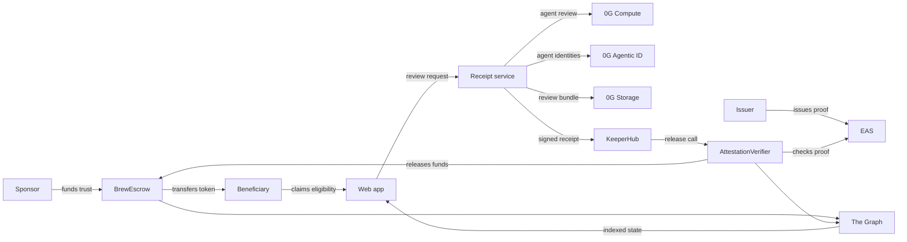

# Brew

Brew is a conditional trust-release app for the ETHGlobal Open Agents hackathon.
A sponsor locks ERC-20 funds in escrow, a beneficiary attaches an EAS proof, and
a 0G-backed review council produces a signed release receipt. KeeperHub then
executes the onchain release through `AttestationVerifier`.

The project is intentionally not an "AI moves money" demo. AI agents review the
evidence and seal a receipt; the contracts still enforce the release rules.

AI was also used as development assistance during the hackathon. See
[AI usage](docs/ai-usage.md) for the compact disclosure.

## Current Flow

```text
Sponsor creates trust on Base Sepolia
-> Beneficiary / issuer attaches an EAS attestation
-> Web app asks receipt-service to review the trust
-> receipt-service runs 0G Evidence / Policy / Risk agents
-> receipt-service stores the review bundle on 0G Storage
-> receipt-service signs an EIP-712 ReviewReceipt
-> receipt-service triggers KeeperHub
-> KeeperHub calls AttestationVerifier.verifyAndReleaseWithReceiptFields(...)
-> AttestationVerifier validates EAS + receipt + signature and releases escrow
```

## System Map



## What To Notice

- **Agentic review, deterministic release**: 0G agents recommend a release, but
  the contracts still enforce the final decision.
- **Inspectable AI output**: the review council's votes and aggregate result are
  stored as a 0G receipt artifact.
- **KeeperHub is in the money path**: the signed receipt is handed to KeeperHub,
  and KeeperHub performs the final web3 action.
- **The UI is not the source of truth**: trust state comes from onchain events
  indexed by The Graph.
- **Agent identities are explicit**: Evidence, Policy, and Risk reviewers are
  represented with 0G Agentic ID references.

## What Is Implemented

- Base Sepolia escrow and verifier contracts.
- EAS schema/template verification.
- The Graph indexing for trusts, templates, releases, refunds, and review
  receipts.
- Next.js web app with landing page, overview, trust creation, trust detail,
  attestation, release trigger, receipt display, and 0G Storage explorer links.
- Railway receipt service for 0G Compute, 0G Storage, EIP-712 signing, and
  KeeperHub webhook handoff.
- 0G Agentic ID references for the Evidence, Policy, and Risk review agents.
- KeeperHub workflow handoff for the final web3 release action.

## Stack

| Layer | Technology |
| --- | --- |
| App | Next.js, RainbowKit, wagmi, viem |
| Contracts | Foundry, Solidity, OpenZeppelin |
| Chain | Base Sepolia |
| Proofs | EAS |
| Indexing | The Graph |
| Agent review | 0G Compute |
| Receipt storage | 0G Storage |
| Agent identity | 0G Agentic ID |
| Execution workflow | KeeperHub |
| Service deploy | Railway |
| Web deploy | Vercel |

## Deployed Demo Config

| Item | Value |
| --- | --- |
| Chain | Base Sepolia `84532` |
| Escrow | `0x9Ddb398600E37a7b68936D316b6889EE21e0EAe9` |
| Verifier | `0xe9aD090798B0CEDb2aaCA48d202f02071ccfb7e5` |
| Demo token | `0x63c972a697dFc788EadC61d9Bdd4BcfEb2abdf7C` |
| Subgraph | `https://api.studio.thegraph.com/query/71401/brew/version/latest` |
| Receipt service | `https://receipt-service-production-189c.up.railway.app` |
| 0G Agentic ID contract | `0x2700F6A3e505402C9daB154C5c6ab9cAEC98EF1F` |

## Docs

- [Workflow](docs/workflow.md): system flow and trust boundaries.
- [Demo runbook](docs/demo-runbook.md): short live-demo checklist.
- [Submission checklist](docs/submission-checklist.md): final prize and rules
  review before submitting.
- [AI usage](docs/ai-usage.md): runtime AI and development-assistance
  disclosure.
- [KeeperHub feedback](FEEDBACK.md): integration feedback and reproducible
  issues.
- [Contracts](packages/contracts/README.md): deploy, configure, and simulate.
- [Web](packages/web/README.md): web app setup and runtime env.
- [Receipt service](packages/receipt-service/README.md): 0G review, storage,
  signing, Agentic ID, and Railway setup.
- [Subgraph](packages/subgraphs/brew/README.md): indexing setup and endpoint.

## Local Development

Run each package from its own directory:

```bash
cd packages/web
yarn install
cp .env.example .env.local
yarn dev
```

```bash
cd packages/receipt-service
yarn install
cp .env.example .env.local
yarn start
```

```bash
cd packages/contracts
cp .env.example .env
forge build
forge test
```

## Demo Boundary

The demo path uses public testnet contracts and public review receipts. The
privacy-preserving version is out of scope for this hackathon build. The current
goal is to prove a clean agentic release path:

```text
review by agents -> stored receipt -> signed receipt -> deterministic release
```
