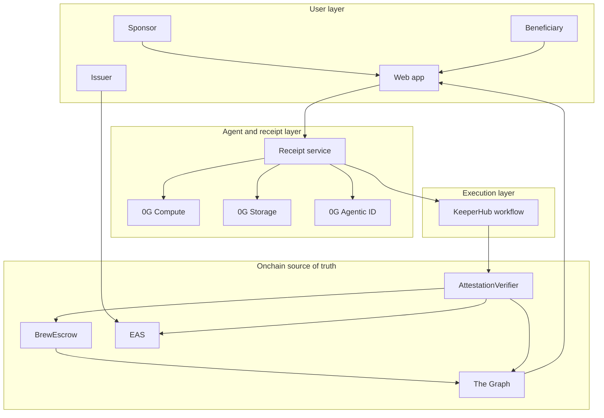
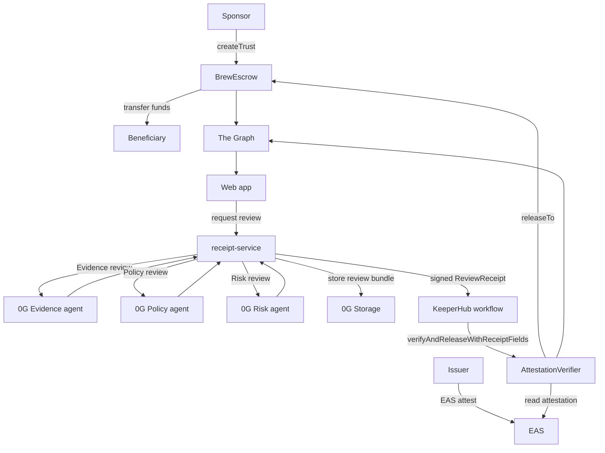

# Brew Workflow

Brew separates the review layer from the release authority.

0G agents can recommend a release, but they cannot move funds directly. The
release still has to pass contract checks in `AttestationVerifier` and
`BrewEscrow`.

## Actors

| Actor | Role |
| --- | --- |
| Sponsor | Creates a trust and deposits ERC-20 funds into escrow. |
| Beneficiary | Receives funds after the required proof is accepted. |
| Issuer | Issues an EAS attestation for the beneficiary. |
| 0G Release Council | Evidence, Policy, and Risk agents review the trust context. |
| Receipt service | Runs the council, stores the review bundle, signs the receipt. |
| KeeperHub | Executes the final onchain release workflow. |
| Contracts | Enforce EAS, template, receipt, signature, and escrow state rules. |

## Entity Responsibilities



The important boundary is between `AgentLayer` and `ChainLayer`: the agent layer
can create evidence and recommendations, but only the chain layer can release
funds.

## High-Level Flow



## Release Council

The review council is a bounded hackathon swarm, not a free-form P2P agent
network. The receipt service sends the same trust context to three role-specific
0G Compute calls:

- Evidence agent: checks whether the proof fields are complete.
- Policy agent: checks whether the proof matches the template and release rule.
- Risk agent: looks for release blockers such as refund/release conflicts.

The deterministic quorum rule is:

```text
Evidence approve + Policy approve + Risk pass
```

Only a passing quorum can produce a signed receipt for the release path.
In the stored receipt bundle this is shown as `risk no-veto`; in the current
implementation that means the Risk agent returns `pass`.

## Receipt Artifact

The stored artifact is the full review bundle:

```text
trust context
+ agentic IDs
+ per-agent votes
+ aggregate quorum result
+ shared context digest
+ 0G Compute response metadata
```

The contract-facing receipt stays small:

```text
trustId
beneficiary
attestationUid
templateId
receiptRoot
receiptUri
coordinator
verdict
createdAt
expiresAt
coordinatorSignature
```

`receiptRoot` is the 0G Storage root of the persisted review bundle.
`coordinatorSignature` is an EIP-712 signature from an allowlisted review
coordinator.

## Onchain Checks

`AttestationVerifier.verifyAndReleaseWithReceiptFields(...)` checks:

- trust exists and is not already released or refunded;
- EAS attestation exists, is not revoked, and is not stale;
- attestation schema matches the selected Brew template;
- attestation recipient matches the trust beneficiary;
- issuer is allowlisted for the selected template, unless demo open issuer mode
  is explicitly enabled;
- receipt fields match the trust and attestation;
- receipt verdict recommends release;
- receipt has not expired;
- receipt coordinator is allowlisted;
- EIP-712 receipt signature is valid.

If those checks pass, the verifier calls `BrewEscrow.releaseTo(...)`.

## Why KeeperHub Is Still In The Critical Path

KeeperHub is the workflow executor for the web3 action. The receipt service owns
long-running review work because it needs server-side secrets and external
network calls to 0G Compute and 0G Storage. After the receipt is ready, it
hands the signed release payload to KeeperHub, and KeeperHub performs the
contract call.

This keeps the visible release path agentic without giving the AI agents direct
fund-control authority.

## Demo Emphasis

When explaining Brew, emphasize these points first:

- The AI agents are reviewers, not custodians.
- The signed review receipt is the bridge between agent reasoning and onchain
  execution.
- The full review bundle is inspectable on 0G Storage, not hidden in a backend
  log.
- KeeperHub remains visible as the execution workflow that submits the release
  transaction.
- The Graph turns the onchain events into the app's status model.

## Demo Boundary

For live judging, Brew can enable `demoOpenIssuerMode` on `AttestationVerifier`.
This lets any connected wallet issue a demo EAS attestation for a registered
template, while preserving schema, recipient, freshness, receipt, signature, and
escrow checks. A production-style deployment should keep this disabled and rely
on issuer allowlists.
